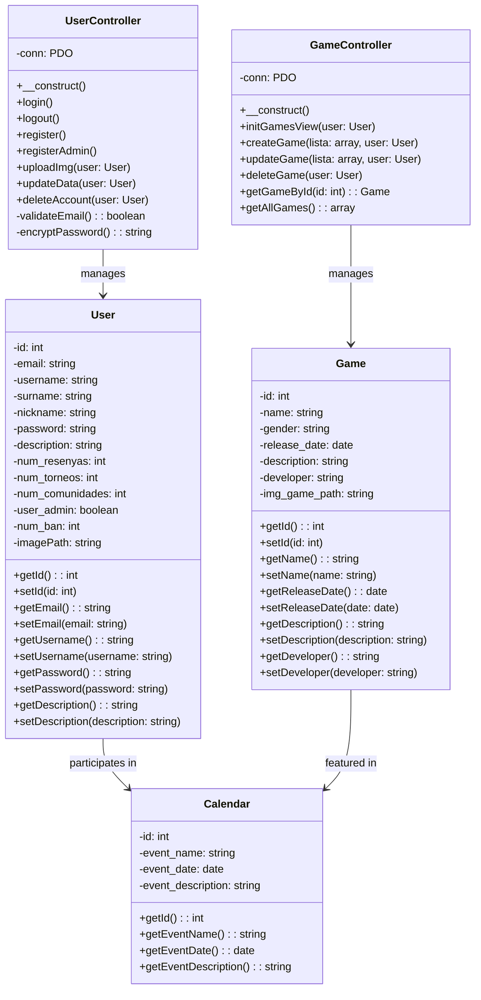
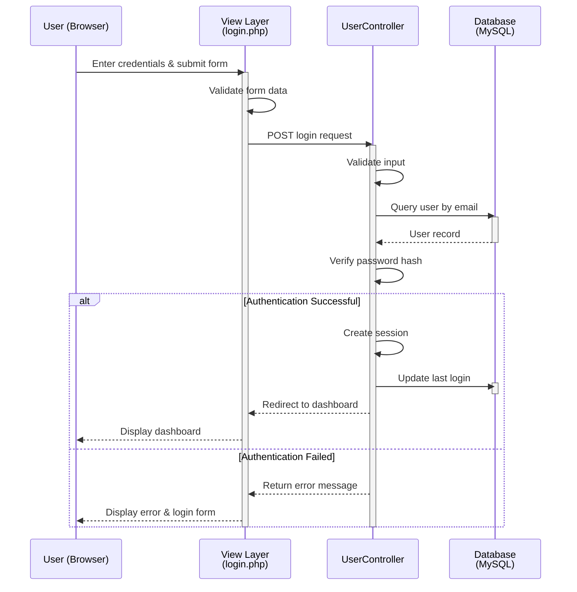
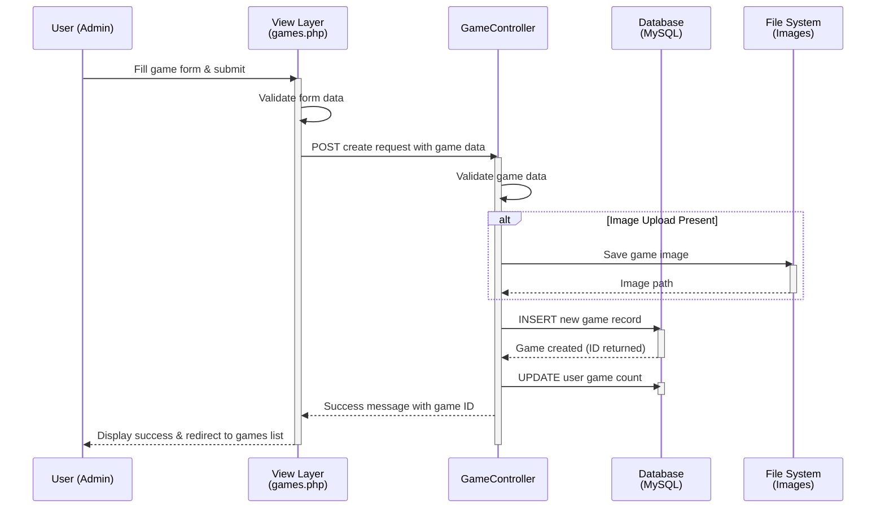

# Invictus - Gaming Community Platform

A PHP-based web application for gaming enthusiasts to review games, participate in tournaments, and manage gaming communities.

## Project Overview

Invictus is a social gaming platform that enables users to:
- Create and manage user profiles
- Review and rate games
- Participate in tournaments
- Join gaming communities
- Access gaming calendar events

## Architecture

### Technology Stack
- **Backend**: PHP with PDO (MySQL)
- **Frontend**: HTML, CSS, JavaScript
- **Libraries**: jQuery, jQuery Validation, Slick Carousel
- **Database**: MySQL

### Project Structure
```
MP0487_RA5RA6_Invictus/
├── Controller/          # Business logic layer
│   ├── GameController.php
│   └── UserController.php
├── Model/              # Data layer
│   ├── User.php
│   ├── Game.php
│   ├── Calendar.php
│   └── Invictus.sql
├── View/               # Presentation layer
│   ├── admin/
│   ├── games/
│   ├── login/
│   ├── profile/
│   ├── settings/
│   ├── signin/
│   └── ...
└── README.md
```

---

## Class Diagram



---

## Sequence Diagram - User Login Flow



---

## Sequence Diagram - Game Creation Flow



---

## Database Schema

### Users Table
```sql
- id (PRIMARY KEY)
- email (UNIQUE)
- username (UNIQUE)
- surname
- nickname
- password (hashed)
- description
- num_resenyas
- num_torneos
- num_comunidades
- user_admin (BOOLEAN)
- num_ban
- imagePath
```

### Games Table
```sql
- id (PRIMARY KEY)
- name
- gender
- release_date
- description
- developer
- img_game_path
```

### Calendar Table
```sql
- id (PRIMARY KEY)
- event_name
- event_date
- event_description
```

---

## Features

### User Management
- User registration and authentication
- Profile management
- Image upload functionality
- Account deletion
- Admin registration

### Game Management
- Create, read, update, delete games
- Game categorization by gender/genre
- Game reviews and ratings
- Developer information tracking
- Game image gallery

### Community Features
- Calendar events management
- Tournament participation
- Community memberships
- User review system

---

## Installation

1. **Clone/Extract** the project to `htdocs` folder
2. **Create Database**: Import `Model/Invictus.sql` into MySQL
3. **Configure Database**: Update connection credentials in controllers
4. **Start Server**: Run Apache and MySQL via XAMPP
5. **Access Application**: Navigate to `http://localhost/MP0487/MP0487_RA5RA6_Invictus/View/index/index.php`

---

## Development Notes

- Uses **MVC (Model-View-Controller)** architecture
- **PDO** for secure database queries with parameterized statements
- **Session management** for user authentication
- **Form validation** with jQuery Validation plugin
- **Responsive design** with Bootstrap and Slick carousel for games

---

## Future Enhancements

- Real-time notifications
- Advanced search and filtering
- Social features (friends, messaging)
- Tournament bracket system
- Payment integration for premium features
- API development

---

## License

Confidential - Educational Project (RA5/RA6)
